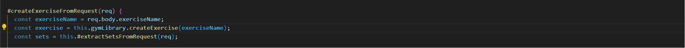
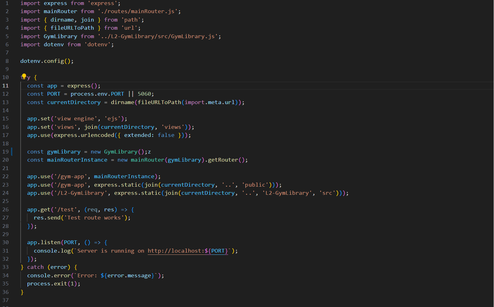
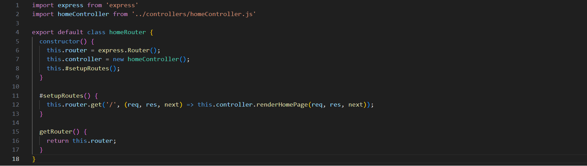
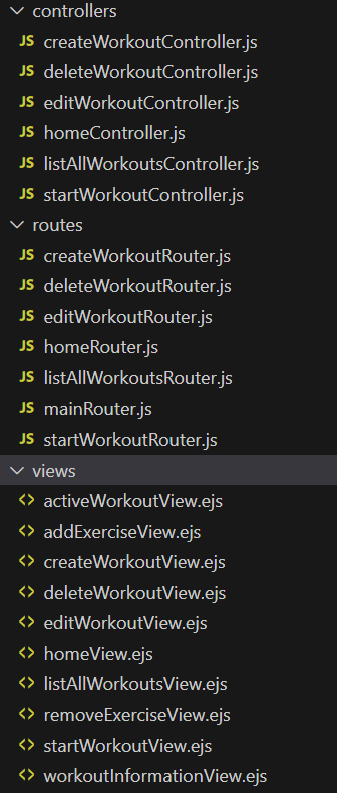

## Chapter 2: Meaningful Names

För att sumera kapitel 2 i clean code så handlar det om att använda så beskrivande och effektiva namn som möjligt. Detta tycker jag är en bra och värdefull sak som jag både har använt och kommer att använda i min framtida kod. Tidigare har jag använt så kort och koncisa namn som möjligt då jag uppfattade att det bidrog till "cleaner" kod. Dock har detta förändrats under kursens gång och jag använder många av bokens principer i följande applikation.

Exempel:

Tidigare hade min första metod kanske hetat endast "renderPage" men enligt principen som "Use intention-revealing names" så kan man direkt tyda vad som faktiskt renderas medans "renderPage" kanske isåfall hade kunnat vara en mer generell metod. Likadant gäller för "redirectToHomePage" metoden så kan man direkt genom bara metod namnet läsa vart man redirectas till.

## Chapter 3: Functions

Kapitel 3 i clean code förespråkar om att skriva små funktioner, som också bara har en uppgift. I min applikation har jag försökt att införa detta så gott det går, då jag verkligen försökt att dela in mer funktionallitet i fler privata metoder. Jag tycker att denna principen kan vara bra då det också kan uppmana till mindre repetrad kod. Kapitlet förespråkar även att man inte bör ha många argument då det leder till mer komplexa metoder. I min applikation jobbar jag dock med requests och responses och då är det uppmanat som en bra vana att använda req,res,next argumenten. 

Exempel:

"getWorkoutNameFromRequeqst" är en egen privat metod som sköter hämtandet av övningsnamnet. Likadant gäller för "redirectToWorkoutList" som sköter omdirigeringen. Dessa metoder anropas sedan i andra metoder men det är fortfarande de privata metoderna som sköter funktionalliteten. Detta leder även till en "higher level of abstraction" vilket är bra enligt clean code.

## Chapter 4: Comments

Kapitel 4 i clean code förespråkar att använda kommentarer endast vid tillfällen då det faktiskt tillför något positivt, "bra kod lär inte behöva några kommentarer". Detta har påverkat min kod i min applikation då man nu inte hittar särkskillt många kommentarer i min kod. Detta behöver inte vara dåligt dock då det också innebär att det har uppmuntrat mig att skriva så utförlig och beskrivande kod som möjligt där kommentarer inte behövs, utan det blir bara extra. Kommentarer används dock fortfarande där det bidrar med något extra.

Exempel:

Denna kommentaren nämner för läsare varför dessa satserna finns, i detta fallet för att hantera enstaka och flera uppsättningar av data som kommer in. Hade denna kommentaren inte funnits hade man kanske undrat varför man hade behövt satserna och kanske tagit bort de, vilket hade förstört funktionalliteten. 

## Chapter 5: Formatting

Kapitel 5 i clean code handlar om visuallisering av kod och att visa konventioner kan leda till mer läsbar och användarvänlig kod. Detta har jag försökt att uppnå så gott det går i min applikation. Jag tror att de flesta när de lär sig att koda får lära sig de "best practices" när det gäller kodstruktur och att det ska vara läsbart är en grundregel. Så mycket finns redan när det gäller hur en filstruktur skall se ut. I till exempel en klass fil så bör klass namnet vara längst upp och därpå följer viktigare metoder som enligt "Newspaper metaphor" i clean code boken.

Exempel: 

En annan sak kapitel 5 nämner är att man skall hålla relevant kod så nära som möjligt vertikalt och att det är bra indela det som man hade indelat text i "stycken". Detta ser man i exemplet då jag har privata metoden "#setupRoutes" nästintill där den anropas.

## Chapter 6: Objects and data structures

I kapitel 6 nämns bland annat Law of Demeter, en princip som förespråkar minimal kännedom och interaktion mellan olika delar av systemet. Enligt denna ska varje del endast kommunicera med nära 'vänner' och inte navigera genom interna strukturer av andra objekt. Detta innebär bland annat att inte använda sig av train-wrecks. 

Exempel:

I mitt exempel med "createExerciseFromRequest" följs denna princip genom att använda gymLibrarys publika interface för att skapa en övning. Metoden begär inte något av den interna informationen av data utan använder sig av den publika metoden som gymLibrary innehåller. På så sätt hålls intern data dold, och createExerciseFromRequest behöver inte känna till detaljerna i gymLibrarys interna struktur.

## Chapter 7: Error Handling

Kapitel 7 i clean code handlar om felhantering. Det förespråkas att man bland annat skall använda sig av att try-catches och exception istället för att returnera nulls eller return codes. 

I min kod har jag tyvärr inte infört mycket felhantering då jag tyvärr har bland annat kännt en tidspress och därmed inte lyckats hantera alla möjliga fel och oönskade fall och därmed har det inte varit fokuset. Dock har jag använt mig av iallafall ett try catch block i min server setup som även returnerar ett felmeddelande ifall något fel uppstår. Detta hade dock detta kunnats förbättras genom att skriva detaljerade meddelanden vid olika typer av fel och sedan också se till så att felen inte når slutanvändaren.

## Chapter 8: Boundaries

Kapitel 8 handlar mycket om använding av third-party code och hur man bör använda sig av de. Det förespråkas att man helst inte ska låta sin kod bli för beroende av APIet man använder och om det sker att man isåfall hanterar det på ett hållbart sätt när det gäller att upprätthålla sin kod. Detta kan tex vara att använda sig av sina egna interfaces/wrappers mellan det som man tar ifrån APIet och sin egna kod så man endast behöver sköta de delarna man använder från APIet. Detta underlättar även proceduren av att sköta förändringar i APIet som i sin tur även kan påverka sin egna kod. Det kan även vara smart att skriva tester baserat på APIet man använder så man vet när det sker förändringar som även kommer att påverka sin egna kod. I mitt fall använder jag endast min egna självskrivna bibliotek "GymLibrary" och därför vet jag själv hur biblioteket fungerar till fullo och därmed har jag inte riktigt tänkt på dessa delarna under skapandet av min applikation.

## Chapter 9 Unit tests

Kapitel 9 i clean code handlar om vikten av testning av sin kod. Det nämns att skriva snabba och slarviga tester kan vara sämre än att inte skriva tester alls. Det betonar hur viktigt det är att skriva "clean" och bra tester och att tester kan är minst lika viktigt som att skriva produktions kod. Att skriva bra tester innefattar att de ska vara lättlästa och förståeliga vilket innebär att de bland annat ska vara enkla och endast testa ett koncept åt gången. "Clean" tester innebär även att de ska vara snabba att köra, de ska inte vara beroende av andra tester, de ska vara repeterbara genom olika miljöer, de ska tydligt validera pass eller fail och att de tillslut ska vara skrivna i god tid. 

För min applikation har mina tester körts manuellt och jag har inte använt mig av skrivna automatiska enhets tester. De är specifierade i testcases.md. 

## Chapter 10: Classes

Kapitel 10 i i clean code betonar bland annat att klasser bör vara små och koncisa och att de ska följa single responsibility principen. Metoder och variabler ska helst också vara så enkapsulerade som möjligt det vill säga att allt inte ska vara åtkomligt och leda till oönskade sidoeffekter eller exponerad data. 

Exempel på en bra klass i min applikation:

Denna klassen är liten och specifierad till att hantera en sak, det vill säga att sköta hem sida routingen. Klassen använder bland annat även inkapsling genom privata metoder och exponerar därför inte någon data utanför klassen där det inte behövs. 

## Chapter 11: Systems

I största del har jag inte tänkt särskillt mycket på detta kapitel 11 under utvecklandet av min app förutom kanske delen med seperations of concerns vilket innefattar att dela upp olika sektioner för att hantera olika problem. Seperations of conerns bidrar bland annat till att applikationen blir lättare att underhålla, lättare att bygga på och lättare att testa. I min applikation har jag tex delat upp olika controllers, routers och views i olika klasser beroende på funktionallitet jämför med att jag istället kanske bara hade haft en enda stor klass för vardera kategori. 

