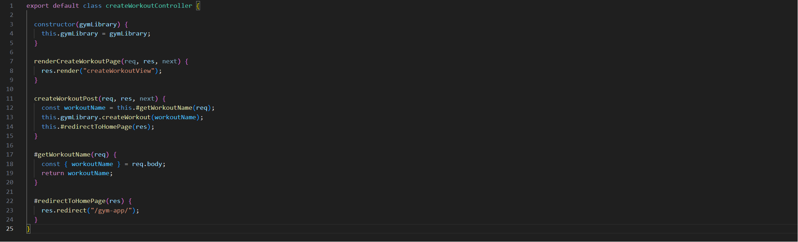
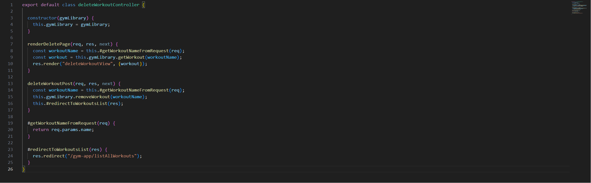
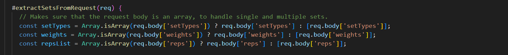
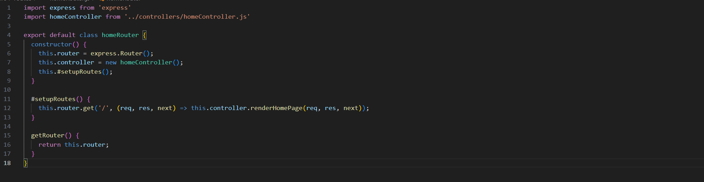

## Chapter 2: Meaningful Names

För att sumera kapitel 2 i clean code så handlar det om att använda så beskrivande och effektiva namn som möjligt. Detta tycker jag är en bra och värdefull sak som jag både har använt och kommer att använda i min framtida kod. Tidigare har jag använt så kort och koncisa namn som möjligt då jag uppfattade att det bidrog till "cleaner" kod. Dock har detta förändrats under kursens gång och jag använder många av bokens principer i följande applikation.

Exempel:

Tidigare hade min första metod kanske hetat endast "renderPage" men enligt principen som "Use intention-revealing names" så kan man direkt tyda vad som faktiskt renderas medans "renderPage" kanske isåfall hade kunnat vara en mer generell metod. Likadant gäller för "redirectToHomePage" metoden så kan man direkt genom bara metod namnet läsa vart man redirectas till.

## Chapter 3: Functions

Kapitel 3 i clean code förespråkar om att skriva små funktioner, som också bara har en uppgift. I min applikation har jag försökt att införa detta så gott det går, då jag verkligen försökt att dela in mer funktionallitet i fler privata metoder. Jag tycker att denna principen kan vara bra då det också kan uppmana till mindre repetrad kod. Kapitlet förespråkar även att man inte bör ha många argument då det leder till mer komplexa metoder. I min applikation jobbar jag dock med requests och responses och då är det uppmanat som en bra vana att använda req,res,next argumenten. 

Exempel:

"getWorkoutNameFromRequeqst" är en egen privat metod som sköter hämtandet av övningsnamnet. Likadant gäller för "redirectToWorkoutList" som sköter omdirigeringen. Dessa metoder anropas sedan i andra metoder men det är fortfarande de privata metoderna som sköter funktionalliteten. Detta leder även till en "higher level of abstraction" vilket är bra enligt clean code.

## Chapter 4: Comments

Kapitel 4 i clean code förespråkar att använda kommentarer endast vid tillfällen då det faktiskt tillför något positivt, "bra kod lär inte behöva några kommentarer". Detta har påverkat min kod i min applikation då man nu inte hittar särkskillt många kommentarer i min kod. Detta behöver inte vara dåligt dock då det också innebär att det har uppmuntrat mig att skriva så utförlig och beskrivande kod som möjligt där kommentarer inte behövs, utan det blir bara extra. Kommentarer används dock fortfarande där det bidrar med något extra.

Exempel:

Denna kommentaren nämner för läsare varför dessa satserna finns, i detta fallet för att hantera enstaka och flera uppsättningar av data som kommer in. Hade denna kommentaren inte funnits hade man kanske undrat varför man hade behövt satserna och kanske tagit bort de, vilket hade förstört funktionalliteten. 

## Chapter 5: Formatting

Kapitel 5 i clean code handlar om visuallisering av kod och att visa konventioner kan leda till mer läsbar och användarvänlig kod. Detta har jag försökt att uppnå så gott det går i min applikation. Jag tror att de flesta när de lär sig att koda får lära sig de "best practices" när det gäller kodstruktur och att det ska vara läsbart är en grundregel. Så mycket finns redan när det gäller hur en filstruktur skall se ut. I till exempel en klass fil så bör klass namnet vara längst upp och därpå följer viktigare metoder som enligt "Newspaper metaphor" i clean code boken.

Exempel: 

En annan sak kapitel 5 nämner är att man skall hålla relevant kod så nära som möjligt vertikalt och att det är bra indela det som man hade indelat text i "stycken". Detta ser man i exemplet då jag har privata metoden "#setupRoutes" nästintill där den anropas.

## Chapter 6: Objects and data structures

## Chapter 7: Error Handling

## Chapter 8: Boundaries

## Chapter 9 Unit tests

## Chapter 10: Classes

## Chapter 11: Systems