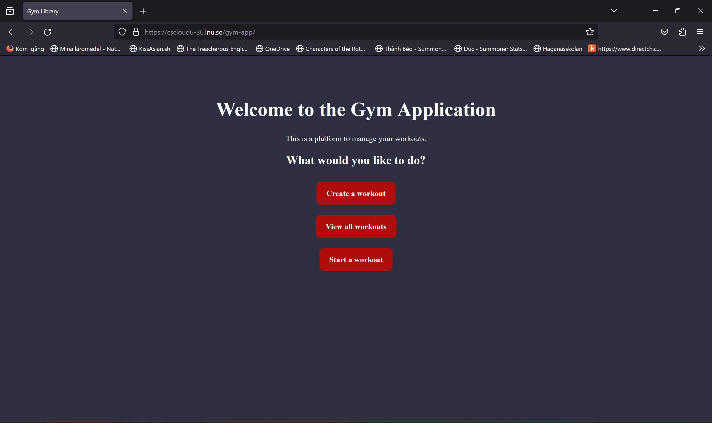
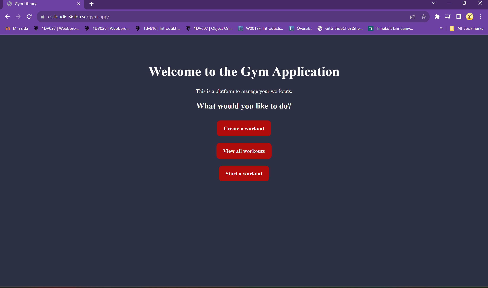

# Test cases

## Test case 1: The user should be able to access the app over the internet.

### Objective: 

Make sure that the web page can be accessed from different browsers.

### Input1.1:

- Ensure the device is connected to an internet network.
- Open mozilla firefox.
- Enter the apps URL into the web browsers adress bar.

### Output1.1:

- The home page is displayed with a greeting message and different options to choose from.

### Input1.2:

- Ensure the device is connected to an internet network.
- Open google chrome.
- Enter the apps URL into the web browsers adress bar.

### Output1.2:

- The home page is displayed with a greeting message and different options to choose from.

## Test case 2.1: Users should be able to create a workout.

### Input:
