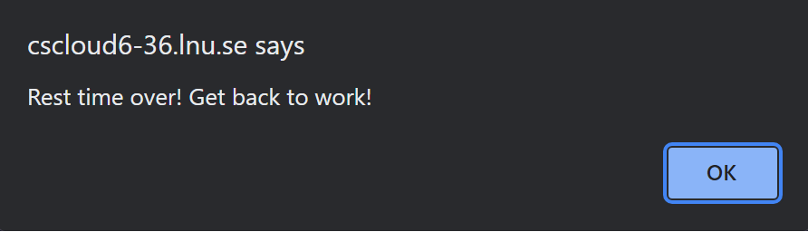

# Test cases

## Test case 1: The app is accessible over the internet through different browsers.

### Input1.1:

- Ensure the device is connected to an internet network.
- Open mozilla firefox. 
- Enter the apps URL into the web browsers adress bar. (https://cscloud6-36.lnu.se/gym-app/)

### Output1.1:

- The home page is displayed with a greeting message and different options to choose from.

### Input1.2:

- Ensure the device is connected to an internet network.
- Open google chrome.
- Enter the apps URL into the web browsers adress bar. (https://cscloud6-36.lnu.se/gym-app/)

### Output1.2:

- The home page is displayed with a greeting message and different options to choose from.

## Test case 2.1: Make sure there is an option for creating workouts:

### Input:

- Navigate to home page

### Output: 

- Button to create a workout.
- Button to view all workouts.
- Button to start a workout.

## Test case 2.2: Succesfully creating a workout:

### Input: 

- Navigate to home page.
- Press "Create a Workout" button. 
- Input "Leg Day"
- Press "Create Workout" button.
- Press "View all workouts button.

### Output:

- Redirected to page where all workouts is shown. Including the created Leg Day workout

## Test case 2.3: Succesfully deleting a workout:

### Input: 

- Clear cache
- Navigate to home page.
- Press "Create a Workout" button. 
- Input "Leg Day"
- Press "Create Workout" button.
- Press "View all workouts button.
- Press on "Leg Day" workout.
- Press on delete a workout. 
- Press on "Confirm Deletion" button. 

### Output:

- Redirected to page where all workouts is shown. The list is now empty.

## Test case 2.4: Succesfully viewing a workout:

### Input: 

- Clear cache
- Navigate to home page.
- Press "Create a Workout" button. 
- Input "Leg Day"
- Press "Create Workout" button.
- Press "View all workouts button.
- Press on "Leg Day" workout.

### Output:

- A page where the created "Leg Day" workout is shown. Including "Showing Workout: Leg Day"

## Test case 2.5: Succesfully viewing all existing workout:

### Input: 

- Clear cache
- Navigate to home page.
- Press "Create a Workout" button. 
- Input "Leg Day"
- Press "Create Workout" button.
- Press "Create a Workout" button. 
- Input "Push"
- Press "View all workouts button.

### Output:

- A page where all workouts are shown. Including the created "Leg Day" and "Push" Workout.

## Test case 3.1: Successfully adding an exercise to a workout.

### Input: 

- Clear cache
- Navigate to home page.
- Press "Create a Workout" button. 
- Input "Leg Day"
- Press "Create Workout" button.
- Press "View all workouts button.
- Press on "Leg Day" workout.
- Press on "Edit Workout" Button.
- Press on "Add Exercise" Button. 
- Enter "Squat" in Exercise Name field
- Enter Warmup set in type of set field
- Enter "60" in weight:kg field
- Enter "8" in reps field
- Press on "Add set" button.
- Press on "Add Exercise" button.  

### Output:

- Redirected to editing workout leg day page. The page shows the added exercise "Squat".

## Test case 3.2: deleting an exercise from a workout.

### Input: 

- Clear cache
- Navigate to home page.
- Press "Create a Workout" button. 
- Input "Leg Day"
- Press "Create Workout" button.
- Press "View all workouts button.
- Press on "Leg Day" workout.
- Press on "Edit Workout" Button.
- Press on "Add Exercise" Button. 
- Enter "Squat" in Exercise Name field
- Enter Warmup set in type of set field
- Enter "60" in weight:kg field
- Enter "8" in reps field
- Press on "Add set" button.
- Press on "Add Exercise" button.  
- Press on "Remove Exercise" button.
- Press on "Confirm deletion" button.

### Output:

- Redirected to editing workout leg day page. The page shows no existing exercies.

## Test case 4.1: Succesfully adding multiple warmup set to an exercise.

### Input: 

- Clear cache
- Navigate to home page.
- Press "Create a Workout" button. 
- Input "Leg Day"
- Press "Create Workout" button.
- Press "View all workouts button.
- Press on "Leg Day" workout.
- Press on "Edit Workout" Button.
- Press on "Add Exercise" Button. 
- Enter "Squat" in Exercise Name field
- Enter Warmup set in type of set field
- Enter "60" in weight:kg field
- Enter "8" in reps field
- Press on "Add set" button.
- Enter "Squat" in Exercise Name field
- Enter Warmup set in type of set field
- Enter "90" in weight:kg field
- Enter "4" in reps field
- Press on "Add set" button.

### Output:

- Labels with the added set details appears. Including that this is a warmup set

## Test case 4.2: Succesfully adding multiple working sets to an exercise.

### Input: 

- Clear cache
- Navigate to home page.
- Press "Create a Workout" button. 
- Input "Leg Day"
- Press "Create Workout" button.
- Press "View all workouts button.
- Press on "Leg Day" workout.
- Press on "Edit Workout" Button.
- Press on "Add Exercise" Button. 
- Enter "Squat" in Exercise Name field
- Enter Working set in type of set field
- Enter "120" in weight:kg field
- Enter "8" in reps field
- Press on "Add set" button.
- Enter "Squat" in Exercise Name field
- Enter Working set in type of set field
- Enter "120" in weight:kg field
- Enter "8" in reps field
- Press on "Add set" button.

### Output:

- Labels with the added set details appears. Including that this is a warmup set

## Test case 5: Succesfully starting a workout.

### Input: 

- Clear cache
- Navigate to home page.
- Press "Create a Workout" button. 
- Input "Leg Day"
- Press "Create Workout" button.
- Press "View all workouts button.
- Press on "Leg Day" workout.
- Press on "Edit Workout" Button.
- Press on "Add Exercise" Button. 
- Enter "Squat" in Exercise Name field
- Enter Warmup set in type of set field
- Enter "60" in weight:kg field
- Enter "8" in reps field
- Press on "Add set" button.
- Enter "Squat" in Exercise Name field
- Enter Warmup set in type of set field
- Enter "100" in weight:kg field
- Enter "4" in reps field
- Press on "Add set" button.
- Enter "Squat" in Exercise Name field
- Enter Working set in type of set field
- Enter "120" in weight:kg field
- Enter "8" in reps field
- Press on "Add set" button.
- Enter "Squat" in Exercise Name field
- Enter Working set in type of set field
- Enter "120" in weight:kg field
- Enter "8" in reps field
- Press on "Add set" button.
- Press on "Add Exercise button"
- Press on "Back To Workouts" button
- Press on "Back To All Workouts" button
- Press on "Back To home" button
- Press on "Start a workout" button
- Press on Leg Day

### Output: 

- A page where the active Leg Day workout is shown. Including an active timer, Leg Day workout information and a rest timer.

## Test case 6.1: Succesfully starting the rest timer in an active workout.

### Input: 

- Clear cache
- Navigate to home page.
- Press "Create a Workout" button. 
- Input "Leg Day"
- Press "Create Workout" button.
- Press on "Start a workout" button
- Press on Leg Day
- Press on "Start" button 

### Output: 

- The rest timer starts ticking downwards.
- The "Start" button is now showing "Pause.

## Test case 6.2: Succesfully pausing the rest timer in an active workout.

### Input: 

- Clear cache
- Navigate to home page.
- Press "Create a Workout" button. 
- Input "Leg Day"
- Press "Create Workout" button.
- Press on "Start a workout" button
- Press on Leg Day
- Press on "Start" button 
- Let the rest timer hit "02:59"
- Press on "Pause" button

### Output: 

- The rest timer stops ticking downwards. 
- The "Pause" button is now showing "Resume.

## Test case 6.3: Succesfully resetting the rest timer after having it ticked down in an active workout.

### Input: 

- Clear cache
- Navigate to home page.
- Press "Create a Workout" button. 
- Input "Leg Day"
- Press "Create Workout" button.
- Press on "Start a workout" button
- Press on Leg Day
- Press on "Start" button 
- Let the timer tick down.
- Press on "Reset" button.    

### Output: 

- The rest timer is now back to its original state showing "03:00" and a "Start" button.

## Test case 6.4: Succesfully updating the user when the timer ticks down to 00:00.

### Input: 

- Clear cache
- Navigate to home page.
- Press "Create a Workout" button. 
- Input "Leg Day"
- Press "Create Workout" button.
- Press on "Start a workout" button
- Press on Leg Day
- Press on "Start" button 
- Let the timer tick down to 00:00.

### Output: 

- An alert message that says "Rest time over! Get back to work!"

